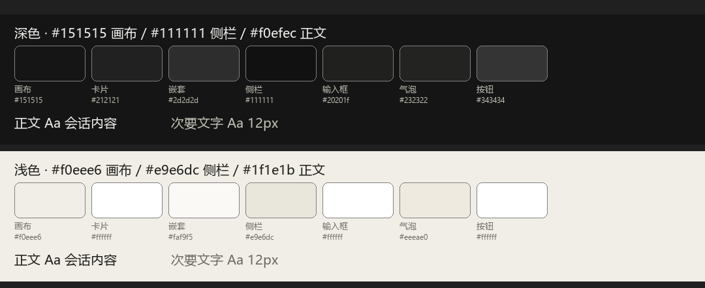

# dsh-bg-theme — 界面底色插件（暖色，取值参考 Claude 桌面端）

给 Harness Web GUI 换一套暖色配色：画布、侧栏、卡片/选择器、输入框、用户气泡、代码块、滚动条、浮层材质，以及正文与次要文字。浅色与深色各一套，跟随设置里已选的「浅色 / 深色 / 跟随系统」自动切换。

只改颜色 token，不动布局、字号和字体族。



## 安装契约（给 agent / 自动化）

本包是一个标准 DSH **bundle 插件**，安装 = 「让包管理服务装上它 + 把它的组合包选入 profile」。等价动作由 `plugin_manager` 工具或插件页完成，不要手写 profile 文件。

- **包身份**：`@local/dsh-bg-theme`，`dsh.bundle.patch: ./cordis.patch.yml`，`dsh.client.platform: web`，`engines.dsh: >=0.1.7-rc.2`
- **安装目标**（任选其一，作为 `install_bundle` 的 `target`，或插件页「添加插件」的输入）：
  - Git 仓库：`https://github.com/zouwj16/dsh-bg-theme`（跟踪默认分支）
  - 固定版本：`https://github.com/zouwj16/dsh-bg-theme#v1.0.1`
  - 本地目录 / 压缩包：仓库目录或 `local-dsh-bg-theme-1.0.1.tgz` 的绝对路径
- **前置**：profile 已启用 `plugin-manager`（`dsh-base` 组合默认启用；`tool-plugin-manager` 默认关闭，用工具前需在 profile patch 里打开那一行）。安装本身对工作区**沙箱无要求**，但 `plugin_manager` 工具调用需要 `danger-full-access` 或本次批准。
- **不变量**：无运行期依赖、无 `peerDependencies`、无安装脚本，所以安装不联网解析依赖、不会触发 pnpm 的构建脚本拦截。
- **装完如何确认**（任选）：
  - 界面：侧栏底色应为 `#111111`（原 `#1b1b1c`），「新会话」按钮应为 `#343434`（原 `#43454a`），正文应为 `#f0efec`（原 `#f9fafb`）。
  - 无头：`GET http://127.0.0.1:<port>/plugins/??@local/dsh-bg-theme/client.js&rev=<rev>` 应返回 200，且正文里含 55 个 `'--dsw-…':` 条目；`rev` 由 `measure/served-revision.mjs` 按 `mtimeMs`/`ctimeMs`/`size` 算出。
  - token 级：读 `ui-theme` 的 `Theme` 快照，`--dsw-alias-bg-base` 应为 `{ light: '#f0eee6', dark: '#151515' }`。
- **启用**：组合包选入后行 id 为 `bg-theme`；宿主重组后即生效。**已经打开的页面不会换上新代码**，需强刷（`Ctrl+Shift+R`）或重启 Harness。
- **卸载**：插件页卸载，或移除组合包选择；配色立即恢复原生。
- **已知边界**：macOS 的菜单/弹出材质不跟随（平台用不透明字面值覆盖了该 token）；`--dsw-hovercard-bg` 硬编码在组件规则里，覆盖层够不着。两者都不影响其余界面。

## 文件

| 文件 | 作用 |
|---|---|
| `package.json` | 组合包清单：`dsh.bundle.patch` 与 `dsh.client`（`platform: web`，先于本行激活 `@deepseek-ai/dsh-client-ui-theme`） |
| `cordis.patch.yml` | 往 profile 插入本插件的一行（id `bg-theme`） |
| `index.js` | 宿主半侧，空实现（本功能全在浏览器侧） |
| `client.js` | 真正的内容：`PALETTE` 常量 + 调用 `ctx.theme.overrideTokens()` 叠加覆盖层 |
| `locale/{zh,en}.json` | 插件页卡片上的标题与描述 |
| `icon.svg` | 插件页卡片图标 |
| `palette.png` | 本套配色的示意（文档） |
| `measure/` | 取值与 revision 的复现脚本、零依赖自检 `verify-palette.mjs`、CI（已启用在 `.github/workflows/verify.yml`，同一份内容保留为模板 `ci-verify.yml`，见 `AGENTS.md`） |
| `measure/patch-window-base.mjs` | 可选：给已安装的 Windows 客户端补上原生窗口底色（消除呼出时的白闪），等长改写 `app.asar`，带 `--verify` / `--revert` / `--self-test` |
| `LICENSE` | MIT |

## 安装

插件页：侧栏**插件** → **添加插件** → 填下表中任一形式 → **安装** → **立即启用**。

| 形式 | 填什么 |
|---|---|
| Git 仓库 | `https://github.com/zouwj16/dsh-bg-theme`（最省事） |
| 压缩包 | `local-dsh-bg-theme-<version>.tgz` 的绝对路径（自包含） |
| 本地目录 | 本仓库目录的绝对路径（开发时用） |
| 包名 | 若发布到 npm，填包名 |

命令行等价步骤（在 profile 目录里执行，`$node` / `$pnpm` 用 DSH 自带运行时）：

```powershell
$node = "$env:USERPROFILE\.dsh\dsh-runtimes\dsh-primary-runtime\dependencies\node\bin\node.exe"
$pnpm = "$env:USERPROFILE\.dsh\dsh-runtimes\dsh-primary-runtime\dependencies\pnpm\bin\pnpm.mjs"
$pluginDir = "<本仓库目录>"
& $node $pnpm add "file:$($pluginDir -replace '\\','/')"
# 再把 @local/dsh-bg-theme 追加进 profile package.json 的 dsh.profile.bundles
```

**卸载**：插件页卸载组合包（或 `pnpm remove` 并从 `dsh.profile.bundles` 里删掉），配色立即恢复原生。

从源码打包与升级：

```powershell
& $node $pnpm pack --pack-destination <输出目录>   # -> local-dsh-bg-theme-<version>.tgz
```

包内不含任何运行时依赖、没有 `peerDependencies`、也没有安装脚本，所以安装不联网解析依赖、也不会触发 pnpm 的构建脚本拦截。升级时把 `version` 提一位、重新 pack 成带新版本号的文件名，再卸载重装即可——带版本的文件名让 pnpm 必须重新落地，绕开「同 spec 不刷新」那个坑。

## 与 profile 的关系

安装会在 profile 的 `package.json` 里加一条 `@local/dsh-bg-theme` 依赖（`file:` 指向仓库目录或 tarball），并把 `@local/dsh-bg-theme` 追加进 `dsh.profile.bundles`；宿主 HMR 在组合包列表变化时自动重组，所以正常安装**不需要重启**。插件页的「已安装」里能看到它。

pnpm 落地这个依赖的方式是**硬链接或目录副本**（实测两处 `client.js` 的 File ID 相同），所以：用本地目录形式安装时，**不要移动或删除该目录**，否则那一行会加载失败。

## 覆盖范围

覆盖的判断标准是「产品里真的拿它画背景的 token」，而不是「看着像表面的 token」。做法是对整个 `app.asar` 扫一遍 `background: var(--dsw-*)`，逐个决定改还是不改，并把这份决定写成插件外的一条硬检查（见下）：

- **表面与文字**：画布、抬升层、侧栏及其三态、卡片/选择器、输入框、气泡、代码块、滚动条、文字阶梯、反色文字与主色填充。
- **悬停/按压底色**：`interactive-bg-hover` 等四个。它们是带 alpha 的叠加色（产品里约 146 条规则在用，是最常用的背景），所以**只换色相、保留原 alpha**——同一底纹在浅深两套下的通透感不变。
- **控件填充**：`button-*` 一族。其中 `button-elevated-fill` 就是侧栏那颗「新会话」按钮，原值 `#43454a` 偏蓝，是用户看出来「没统一」的那一处；Claude 自己的按钮实测是 `#343434`，直接采用。
- **浮层与行内**：tooltip、toast、行内代码、markdown tag。
- **菜单/弹出面板材质**：`--dsw-menu-surface-fill`，只换色相、保留原透明度（浅色 58%、深色 45%），所以背景模糊和通透感不变；Windows/Linux 上的 `--dsw-specific-menu` 由它派生，弹出面板因此一起变暖。macOS 例外：一条 `html[data-platform=darwin] body` 规则把 `--dsw-specific-menu` 换成了不透明字面值，所以 macOS 的菜单仍是冷色——而那一条不能覆盖，否则会改掉平台自己的不透明度。
- **刻意不改**：语义色（`state-*`、`button-info-*`、diff 色、danger 悬停）、遮罩与骨架屏、只出现在欢迎页的 onboarding 卡片。

两处结构上的边界，改不了也不该硬改：

- `--dsw-hovercard-bg` 被**硬编码在组件自己的规则里**（`#2C2C2E`），元素级声明胜过 body 上的覆盖层，`overrideTokens` 够不着。它本身接近中性（`#2C2C2E`），观感影响很小。
- `--dsw-alias-bg-layer-4`、`fill-l1/l2/tertiary/tsp-secondary`、`bg-l1/l2` 这些名字**产品里只有引用、没有定义**，那些元素今天渲染成透明。给它们编一个值会凭空改变这些元素，所以保持不定义。

## 验收记录

在 `desktop` profile 安装并重启后，对整屏截图逐区域取中位色（截图与量色脚本未随仓库分发；方法：按区域中位色 + 全屏 r-b 普查）：

| 区域 | 实测 | 本插件目标值 | 结论 |
|---|---|---|---|
| 侧栏 / 标题栏 | `#111111` | `#111111` | ✓ |
| 画布（会话区） | `#151515` | `#151515` | ✓ |
| 新会话按钮 | `#343434` | `#343434` | ✓ |
| 输入框 | `#20201f` | `#20201f` | ✓ |
| 正文 | `#f0efec` | `#f0efec` | ✓ |
| 行内代码 | `#262523` | `#262523` | ✓ |
| 次要/三级文字 | `#e5e4e1`、`#d9d8d5`、`#9b9a98` | 暖灰阶梯 | ✓ |

同一轮里，全屏只剩菜单弹出面板还是冷色（`#2d2e30`，该区域 60% 像素 r-b ≤ −2），因此补上了 `--dsw-menu-surface-fill`。

## 取值来源

深色方案的表面与文字色**量自一张 Claude 桌面端截图**，不是凭印象调的：

- 全图主色普查 + 逐行扫描线（`measure/sample-screenshot.py`、`measure/scan-surfaces.py`，需要 Pillow），得到画布 `#151515`、卡片 `#212121`、嵌套/芯片 `#2d2d2d`、瓦片 `#383838`、侧栏 `#111111`、输入框 `#20201f`、正文 `#f0efec`、次要文字 `#c3c2b7`、品牌橙 `#d87254`。
- 一个反直觉但决定性的发现：Claude 的**表面是中性灰**（普查里绝大多数像素 r-b = 0），暖的只有**文字**（`#f0efec` 比它的灰更黄，`#c3c2b7` 的 r-b 达到 +12）。所以「更暖」主要靠改文字色，光把表面调暖反而会偏色。
- 浅色方案没有截图可量，是把同一套关系推导到象牙暖白画布上，属于**推导值**。控件填充族没有截图可量（Claude 的按钮只量到那一颗 `#343434`），按同一套层级推导。

## 改配色

`client.js` 里的 `PALETTE` 就是全部配置，每一项形如：

```js
'--dsw-alias-bg-base': { light: '#f0eee6', dark: '#151515' },
```

两个方案都必须给值：主题服务会拒绝只给一个字符串的覆盖层（那会让另一套配色没法看）。

改完的生效方式，分三步，缺一不可：

1. **刷新 profile 里的副本**（必须在第 2 步之前做，顺序反了会坏事，原因见下）。这一步最容易踩坑：pnpm 对**已存在**的本地目录依赖几乎什么都不做——`pnpm add` 直接空操作、`pnpm install --force` 只回一句 "Already up to date"、`pnpm remove` 甚至不会把它从 `package.json` 里删掉（都实测过）；删掉 `node_modules/@local/dsh-bg-theme` 之后 `pnpm install` 也不补回来。可行的顺序是「先删副本，再 remove + add」，而它**也不保证成功**；一旦没落地，直接按目录复制即可（对 Node 的解析而言与 pnpm 的落地等价）：

   ```powershell
   $profileDir = "$env:USERPROFILE\.dsh\profiles\desktop"
   $pluginDir  = "<本仓库目录>"
   Remove-Item -Recurse -Force "$profileDir\node_modules\@local\dsh-bg-theme"
   & $node $pnpm remove '@local/dsh-bg-theme'
   & $node $pnpm add "file:$($pluginDir -replace '\\','/')"
   if (-not (Test-Path "$profileDir\node_modules\@local\dsh-bg-theme\client.js")) {
     New-Item -ItemType Directory -Force "$profileDir\node_modules\@local\dsh-bg-theme" | Out-Null
     Copy-Item "$pluginDir\*" "$profileDir\node_modules\@local\dsh-bg-theme" -Recurse -Force
   }
   ```

   收尾必须核对两份文件逐字节一致（见下方哈希命令）。

2. **让宿主重新快照**：base 组合包的 `hmr.root` 是 `[]`，只监听配置、不监听模块源码；而且 bundle 内容变更**只能经由重组进入模块图**（`rebuilt()`）。HMR 把 profile patch 的**文件内容**也算进重组输入，所以让 `…\profiles\desktop\cordis.patch.yml` 的内容变一下（哪怕加一行注释、随后再还原），宿主就会重新组合并重新快照入口脚本。

   **为什么第 1 步不能放到第 2 步之后**：宿主按文件当前元数据（`mtimeMs`/`ctimeMs`/`size`）实时算出 revision，请求里的 rev 与当前文件不符就返回 404。所以只要在快照之后再动 profile 里的 `client.js`（哪怕字节没变、只是重新落地），页面手里那个 rev 立刻失效——下次加载就是"插件没生效"，甚至比改之前更糟。实测过一次：重装副本后旧 rev 404、新算出的 rev 200。

3. **让页面加载新代码**：已经打开的页面不会换成新代码，页面的模块表还留着已挂载实例的旧闭包（产品自己的限制：「替换包代码及其所有现有消费者不属于普通启停同步」），把行关掉再打开也没换掉（实测）。用 **Ctrl+Shift+R 强刷**；普通 Ctrl+R 可能复用缓存的首页文档、里面是旧的启动图，实测**强刷无效时重启 DeepSeek Harness 一定生效**。

第 2 步做没做、做对没有，可以在没有浏览器的情况下自己验证：按 `dsh-client-modules` 的算法（sha1 框定哈希，输入 `mtimeMs`/`ctimeMs`/`size`）算出当前 revision，再取一次 combo URL，看字节数、token 数和新增 token 是否都在。

```powershell
& $node measure/served-revision.mjs "$env:USERPROFILE\.dsh\profiles\desktop\node_modules\@local\dsh-bg-theme\client.js" '@local/dsh-bg-theme'
# 用它给出的 artifact rev 请求：
# http://127.0.0.1:19387/plugins/??@local/dsh-bg-theme/client.js&rev=<artifact rev>
```

三步都做完仍不对，才需要重启 DeepSeek Harness。

另外 pnpm 是硬链接安装：如果编辑器的保存方式是「写临时文件再改名」，`node_modules` 里那份可能仍指向旧内容。保存后核对两边一致：

```powershell
(Get-FileHash output\dsh-plugins\dsh-bg-theme\client.js).Hash -eq (Get-FileHash "$env:USERPROFILE\.dsh\profiles\desktop\node_modules\@local\dsh-bg-theme\client.js").Hash
```

不一致就按上文「改完的生效方式」第 1 步重新落地（先删副本，再 remove + add）。

保持这几条关系，界面才不会花：

- `--dsw-alias-bg-layer-3` 和 `--dsw-alias-bg-overlay` 同时被当作反色文字用（例如深底标签上的字），必须留在原来的明度带里——浅色保持接近白、深色保持足够深。
- 侧栏三态跟随侧栏底色：浅色方案里逐级更深，深色方案里逐级更浅。
- 文字阶梯 primary → secondary → tertiary → caption 必须单调（深色由亮到暗，浅色由暗到亮）。
- 画布与侧栏底色至少差 3 个色阶，否则两栏会糊成一片（深色方案实测只差 4 阶，这已经是 Claude 的原始间距）。
- 带 alpha 的叠加色只改色相、不改 alpha：改了 alpha 会连带改变所有悬停态的深浅。
- 原值相同的 token 保持相同（例如 `brand-primary` 与 `brand-primary-invert` 在原样式表里就是一对同值，不要顺手让后者"反过来"）。

上面每一条都由 `tmp/verify-bg-theme.mjs` 以脚本形式检查，另外它还检查「产品里画背景的每个 token 要么被覆盖、要么在已复核的跳过名单里」——漏掉一类控件表面会在这里报错，而不是等到在界面上被你发现。

## 与原值对照

原值由脚本从已安装的 `design-platform` 样式表解析得到，不是手抄。

| Token | 原浅色 | 新浅色 | 原深色 | 新深色 |
|---|---|---|---|---|
| `--dsw-alias-bg-base` | #fff | `#f0eee6` | #151517 | `#151515` |
| `--dsw-alias-bg-layer-1` | #fff | `#ffffff` | #232324 | `#212121` |
| `--dsw-alias-bg-layer-2` | #fff | `#faf9f5` | #2c2c2e | `#2d2d2d` |
| `--dsw-alias-bg-layer-3` | #fff | `#ffffff` | #353638 | `#383838` |
| `--dsw-alias-bg-overlay` | #e9ecf2 | `#ffffff` | #61666b | `#2d2d2d` |
| `--dsw-alias-bg-document-preview` | #ebeef2 | `#ffffff` | #151517 | `#1b1b1a` |
| `--dsw-specific-sidebar-fill` | #f9fafb | `#e9e6dc` | #1b1b1c | `#111111` |
| `--dsw-specific-sidebar-nav-item-hover` | #f1f3f5 | `#e4e1d6` | #2c2c2e | `#1c1c1c` |
| `--dsw-specific-sidebar-nav-item-active` | #ebeef2 | `#ded9cc` | #43454a | `#242424` |
| `--dsw-specific-sidebar-nav-item-active-accent` | #e4edfd | `#e6dccf` | #353638 | `#2e2d2b` |
| `--dsw-alias-bg-module-platform` | #f5f6f7 | `#f5f3ed` | #353638 | `#212121` |
| `--dsw-alias-bg-multi-select` | #f5f6f7 | `#f5f3ed` | #212123 | `#2d2d2d` |
| `--dsw-specific-selector` | #f5f6f7 | `#f5f3ed` | #353638 | `#2d2d2d` |
| `--dsw-specific-tip` | #f5f6f7 | `#f5f3ed` | #353638 | `#343434` |
| `--dsw-specific-input-major` | #fff | `#ffffff` | #2c2c2e | `#20201f` |
| `--dsw-specific-bubble` | #edf3fe | `#eeeae0` | #2c2c2e | `#232322` |
| `--dsw-specific-bubble-highlight` | #d3e2ff | `#ded8c9` | #43454a | `#33332f` |
| `--dsw-alias-label-primary` | #0f1115 | `#1f1e1b` | #f9fafb | `#f0efec` |
| `--dsw-alias-label-secondary` | #61666b | `#6b6a63` | #cfd3d6 | `#c3c2b7` |
| `--dsw-alias-label-tertiary` | #81858c | `#8a887f` | #adb2b8 | `#a8a69b` |
| `--dsw-alias-label-caption` | #adb2b8 | `#b0aea4` | #81858c | `#7d7b73` |
| `--dsw-alias-label-primary-dimmed` | #151517 | `#2a2925` | #ebeef2 | `#e6e3db` |
| `--dsw-alias-label-dimmed` | #e1e5ee | `#e4e1d8` | #43454a | `#3d3c38` |
| `--dsw-alias-label-document-preview` | #61666b | `#6b6a63` | #cfd3d6 | `#c3c2b7` |
| `--dsw-alias-label-primary-foreground` | #fff | `#ffffff` | #0f1115 | `#1f1e1b` |
| `--dsw-alias-brand-primary` | #0f1115 | `#1f1e1b` | #f9fafb | `#f0efec` |
| `--dsw-alias-brand-primary-invert` | #0f1115 | `#1f1e1b` | #f9fafb | `#f0efec` |
| `--dsw-alias-interactive-bg-hover` | #2631480f | `#2b271f0f` | #ffffff14 | `#f5f0e614` |
| `--dsw-alias-interactive-bg-active` | #2631481a | `#2b271f1a` | #ffffff24 | `#f5f0e624` |
| `--dsw-alias-interactive-bg-hover-accent` | #26314824 | `#2b271f24` | #ffffff3d | `#f5f0e63d` |
| `--dsw-alias-interactive-bg-hover-solid` | #f1f3f5 | `#eae7dd` | #353638 | `#383838` |
| `--dsw-alias-button-elevated-fill` | #fff | `#ffffff` | #43454a | `#343434` |
| `--dsw-alias-button-floating-fill` | #fff | `#ffffff` | #2c2c2e | `#2d2d2d` |
| `--dsw-alias-button-floating-hover` | #f1f3f5 | `#eae7dd` | #353638 | `#383838` |
| `--dsw-alias-button-ghost-active-fill` | #ebeef2 | `#e4e1d8` | #43454a | `#383838` |
| `--dsw-alias-button-ghost-active-hover` | #e9ecf2 | `#ded9cc` | #61666b | `#45443f` |
| `--dsw-alias-button-ghost-active-border` | #979da6 | `#8a887f` | #81858c | `#8a877c` |
| `--dsw-alias-button-primary-dimmed` | #ebeef2 | `#e4e1d8` | #43454a | `#383838` |
| `--dsw-alias-button-primary-fill` | #0f1115 | `#1f1e1b` | #f9fafb | `#f0efec` |
| `--dsw-alias-button-primary-hover` | #43454a | `#3a3934` | #ebeef2 | `#e6e3db` |
| `--dsw-alias-button-contrast-fill` | #61666b | `#6b6a63` | #f9fafb | `#f0efec` |
| `--dsw-alias-button-tool-bar-fill` | #54555780 | `#4a4a4780` | #54555780 | `#4a4a4780` |
| `--dsw-alias-button-tool-bar-hover` | #54555799 | `#4a4a4799` | #54555799 | `#4a4a4799` |
| `--dsw-alias-button-tool-bar-fill-invisible` | #1f1f1f5c | `#1f1e1b5c` | #1f1f1f5c | `#1f1e1b5c` |
| `--dsw-alias-tooltip-bg` | #2c2c2e | `#2f2e2a` | #43454a | `#45443f` |
| `--dsw-alias-toast-bg` | #353638 | `#383733` | #43454a | `#45443f` |
| `--dsw-alias-markdown-inline-code` | #fafafa | `#f5f3ed` | #292929 | `#262523` |
| `--dsw-alias-markdown-tag` | #f1f3f5 | `#eae7dd` | #2c2c2e | `#2d2d2d` |
| `--dsw-menu-surface-fill` | #f8f9fa94 | `#f5f3ed94` | #43454a73 | `#45443f73` |
| `--dsw-alias-markdown-code-block` | #f9fafb | `#f7f5ef` | #1b1b1c | `#1c1c1b` |
| `--dsw-alias-markdown-code-block-banner` | #f9fafb | `#eae7dd` | #2c2c2e | `#242423` |
| `--dsw-alias-scrollbar-bg-l1` | #e5e5e5 | `#d6d1c4` | #3c3c3d | `#2a2a2a` |
| `--dsw-alias-scrollbar-bg-l2` | #e5e5e5 | `#ccc6b7` | #545557 | `#333333` |
| `--dsw-alias-scrollbar-hover-l1` | #d4d4d4 | `#c2bbaa` | #545557 | `#3f3f3d` |
| `--dsw-alias-scrollbar-hover-l2` | #d4d4d4 | `#b6ae9c` | #65676b | `#4a4a47` |

菜单材质（`--dsw-specific-menu` / `--dsw-menu-surface-fill`）和遮罩层刻意不动：它们是半透明材质 token，改了会连带影响浮层。

## 字体：为什么这里没有覆盖

把参考截图的标题文字放大 4 倍，与本机候选字体逐字对齐比对：截图里 `g` 的开尾钩、`j` 的点与尾、`e` 的横杠、`?` 的曲线都和 **Segoe UI / Segoe UI Variable** 吻合，而 Noto Sans SC 的 `g`、`j` 明显不同。（比对图含个人截图内容，未随仓库分发。）

也就是说，Claude 在 Windows 上渲染用的就是回退到的 Segoe UI——而 DSH 的默认字体栈在 Windows 上第一个可用项同样是 `"Segoe UI"`。**两边本来就是同一个字体**，这里再覆盖一次不会带来任何变化，反而有风险：`--dsw-font-family` 是全平台共用的，把 Windows 字体钉到最前面会让 macOS 客户端丢掉 `-apple-system`。

想强制指定字体族时，加一项即可（两个方案都要写）：

```js
'--dsw-font-family': {
  light: '"Inter", "Segoe UI Variable Text", "Segoe UI", "Microsoft YaHei", sans-serif',
  dark:  '"Inter", "Segoe UI Variable Text", "Segoe UI", "Microsoft YaHei", sans-serif',
},
```

Anthropic 自己用的 Styrene / Tiempos 是商业字体，本机没有；最接近的开源替代是 Inter，需要先装字体再按上面这行接进来。

## 原生窗口底色（Windows 白闪修复）

Windows 客户端的主窗口在创建时没有 `backgroundColor`，原生底色就是 Electron 的默认白色。只要窗口在 Chromium 提交新帧之前被系统"露出来"——点任务栏还原的窗口动画、从托盘呼出的显示动画、隐藏后重建表面——白底就会闪一下。**这一处插件改不了**：bundle 插件跑在渲染/宿主进程，只能覆盖 CSS token，够不到原生窗口。

`measure/patch-window-base.mjs` 用等长就地改写把它修掉，改的是**已安装客户端的 `app.asar`**，不是本仓库的插件代码：

```powershell
$node = "$env:USERPROFILE\.dsh\dsh-runtimes\dsh-primary-runtime\dependencies\node\bin\node.exe"
& $node measure/patch-window-base.mjs             # 干跑：只打印计划，不写任何东西
& $node measure/patch-window-base.mjs --apply     # 打补丁，并写下回滚状态
& $node measure/patch-window-base.mjs --verify    # 全归档逐块 SHA-256 校验
& $node measure/patch-window-base.mjs --revert    # 干跑回滚；加 --apply 才写回
& $node measure/patch-window-base.mjs --self-test # 不装 DSH 也能跑的夹具自检
```

两处改动都在 `lib/main.js`：

1. Windows 主窗口创建时给出不透明底色（与标题栏 overlay 同一个 `chromeFallbackFill()`）；
2. `windowsAppearance` 这条 IPC 本来就负责把渲染进程实测的侧栏底色交给主进程（标题栏在用），现在同一个值也同步给窗口底色——所以装上本插件后闪的是本插件的 `#111111` / `#e9e6dc`，换任何主题都会跟着走，不用改脚本。

`lib/main.js` 写入前后字节数完全相同（插入的字节从 `chromeFallbackFill()` 上方那段注释里等量扣除），归档索引偏移全部不变，归档头中该文件的 SHA-256 同步更新；除这两处与那一段注释外，归档逐字节不变。

注意：

- 需要**重启 DeepSeek Harness**（托盘图标 → 退出应用，再启动）才生效。
- 回滚状态在 `<app.asar>.window-base-backup\`（`header.bin` / `main.js.bin` / `state.json`，约 3.9 MB）。`--revert` 只在当前 `lib/main.js` 与记录相符时才写回，被升级换过的归档会拒绝覆盖。
- **DSH 升级会换掉 `app.asar`**，补丁随之消失：升级后重跑一次 `--apply`；`--verify` 会告诉你补丁还在不在。
- 只对 Windows 客户端有意义；macOS 客户端本来就是透明底 + vibrancy，不需要。
- 脚本靠 `lib/main.js` 里的锚点工作，锚点变了（产品改动）它会报错退出，不会瞎改。

## 已知边界

- **不是持久化的主题偏好。** 覆盖层不进 `ui-theme` 的 settings schema，每次加载由插件重新叠加；设置里的浅色/深色/字号仍然有效，并决定哪一套值生效。
- **浅色方案是推导值。** 深色量的是一张 Claude 截图，浅色是按同一暖色系推的，没有对应截图可核。
- **未做视觉验证。** 本插件是离线核对的产物（清单、YAML、token 名、对比度、明度阶梯都过了脚本检查），没有在运行中的页面上目视确认过。若某处观感不对，改 `PALETTE` 里对应的 token 即可。
- **只覆盖颜色。** 字体族、字号仍归内置 `ui-theme` 的字号设置与 `--dsw-font-family`。
- **原生窗口底色不在插件范围内。** 白闪只能靠 `measure/patch-window-base.mjs` 改已安装客户端的 `app.asar`，而且产品升级会覆盖它；插件半侧永远够不到原生窗口。
- **补丁只覆盖产品主窗口。** `createWindow()` 全产品只被调用一次（就是那个主窗口）；欢迎窗和浮层本来就自带底色。企业 policy 的登录窗（`lib/main.js` 里带 `policyLoginTitle` 的那处 `new BrowserWindow`）没有底色，仍会闪一下——它只在配置了 policy 的登录流程里出现一次，所以按边界处理、没有纳入补丁。要覆盖它就是在仓库脚本的 `EDITS` 里再加一条同样形状的等长改动。
